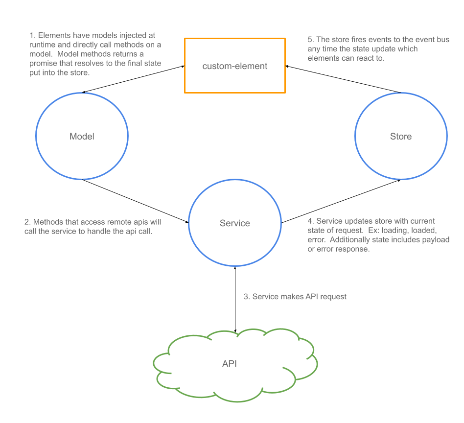

# Cork App Utils

- [Install](#install)
- [BaseModel](#basemodel)
- [BaseService](#baseservice)
- [BaseStore](#basestore)
- [EventBus](#eventbus)
- [Wiring to UI](#wiring-to-ui)
- [CLI](#cli)

# Install

```bash
npm i -s @ucd-lib/cork-app-utils 
```

# Overview



# BaseModel

The BaseModel exposes the event bus and has helper methods
for registering with the global model registry.  This global object
is used by Element interface mixins to inject the models into
elements.

### Attributes

 - eventBus : EventBus

### Methods

 - register(name: String)
   - Register the model
 - emit(event: String, payload: Object)
   - Emit event to event bus

### Example Usage

```javascript
const {BaseModel} = require('@ucd-lib/cork-app-utils');
const ExampleStore = require('../stores/ExampleStore');
const ExampleService = require('../service/ExampleService');

class ExampleModel extends BaseModel {

  constructor() {
    super();

    this.store = ExampleStore;
    this.service = ExampleService;

    this.register('ExampleModel');
  }

  /**
   * @method get
   * @description In this example we will fetch some data
   * using our service.  The service may return some
   * data already cached in the store.  The returned 
   * data will be in a State Payload Wrapper.
   *
   * @returns {Promise}
   */
  async get(id) {
    // get current state
    let state = this.store.get(id);

    // wait for the service to do it's thing
    // if you are interested in the loading events
    // you will want to set event listeners
    try {

      // check to see if we are already loading this resource
      if( state.state === 'loading' ) {
        // make sure you store the request promise in the store as 'request'
        // then you can await here on it as a semaphore, preventing duplicate 
        // requests if multiple UI elements request a resource at the same time
        await state.request;
      } else {
        // the return from the service is the network respons
        // not the state response which is stored in the store
        await this.service.get(id);
      }

    } catch(e) {
      // handle network error here if you want to handle in model
      // but error state should be capture by store and UI elements 
      // should react to the error state event
    }

    // regardless of the network success/failure of request above
    // return the current state
    return this.store.get(id);
  }

  /**
   * @method set
   * @description Update some app state
   */
  set(data) {
    this.store.update(data)
  }
}

module.exports = new ExampleModel();
```

# BaseService

The BaseService exposes helper functions to call rest services

### Attributes

 - eventBus : EventBus

### Methods

 - request(options: Object)
   - Make a fetch request

### Example Usage

```javascript
const {BaseService} = require('@ucd-lib/cork-app-utils');
const ExampleStore = require('../stores/ExampleStore');

class ExampleService extends BaseService {

  constructor() {
    super();

    this.store = ExampleStore;
  }

  async get(id) {
    return this.request({
      url : `/api/get/${id}`,
      // optional
      // if the state is 'loading' and another request for this object
      // comes in, both requests will wait on the same promise preventing
      // two network requests for the same object
      checkCached : () => this.store.data.byId[id],
      // request is a promise to resolves when network request finished (success or failure)
      onLoading : request => this.store.setLoading(id, request),
      onLoad : result => this.store.setLoaded(id, result.body),
      onError : e => this.store.setError(id, e)
    });
  }
}

module.exports = new ExampleService();
```

# BaseStore

The ServiceModel exposes helper functions to call rest services

### Attributes

 - eventBus : EventBus

### Methods

 - request(options: Object)
   - Make a fetch request

### Example Usage

```javascript
const {BaseStore} = require('@ucd-lib/cork-app-utils');

class ExampleStore extends BaseStore {

  constructor() {
    super();

    this.data = {
      byId : {}
    }

    this.events = {
      EXAMPLE_UPDATE = 'example-update'
    }
  }

  // request is the network request promise
  // always store this so we can wait on it if a second
  // entity requests this same resource
  setLoading(id, request) {
    this._setState({
      state: this.STATE.LOADING, 
      id, request
    });
  }

  setLoaded(id, payload) {
    this._setState({
      state: this.STATE.LOADED,   
      id, payload
    });
  }

  setError(id, error) {
    this._setState({
      state: this.STATE.ERROR,   
      id, error
    });
  }

  _setState(id, state) {
    // optionally check that state has actually changed
    // this is helpful to prevent multiple events of same state that sometimes occur
    // if( !this.stateChanged(this.data.byId[id], state) ) return;

    this.data.byId[id] = state
    this.emit(this.events.EXAMPLE_UPDATE, state);
  }
}

module.exports = new ExampleStore();
```


# EventBus

Global instance of EventEmitter class.


# Wiring to UI

## LitElement

```js
import { LitElement } from 'lit-element';
import render from "./my-element.tpl.js"

// sets globals Mixin and EventInterface
import "@ucd-lib/cork-app-utils";

export default class MyElement extends Mixin(LitElement)
  .with(LitCorkUtils) {

  constructor() {
    super();
    this.render = render.bind(this);

    this._injectModel('ExampleModel');
  }

  showData(id) {
    let data = await this.ExampleModel.get('someId');
    // you can do stuff with
  }

  // LitCorkUtils will automatically wire up this method
  // to the example-update event.
  _onExampleUpdate(e) {
    if( e.state === 'loading' ) {

    } else if( e.state === 'loaded' ) {

    } else if( e.state === 'error' ) {

    }
  }

  _setExample() {
    this.ExampleModel.set({
      my : 'new state'
    });
  }
}

customElements.define('my-element', MyElement);
```

## Polymer 3.0 element (MAINTANCE)

```js
import {PolymerElement} from "@polymer/polymer"

// sets globals Mixin and EventInterface
import "@ucd-lib/cork-app-utils";

export default class MyElement extends Mixin(PolymerElement)
  .with(EventInterface) {

  constructor() {
    super();
    this._injectModel('ExampleModel');
  }

  render(id) {
    // _getExample added from ExampleInterface
    let data = await this.ExampleModel.get('someId');
    // you can do stuff with
  }

  // EventInterface will automatically wire up this method
  // to the example-update event.
  _onExampleUpdate(e) {
    if( e.state === 'loading' ) {

    } else if( e.state === 'loaded' ) {

    } else if( e.state === 'error' ) {

    }
  }

  _setExample() {
    this.ExampleModel.set({
      my : 'new state'
    });
  }
}

customElements.define('my-element', MyElement);
```


# Wiring to UI with Interface (DEPRECATED)

## Model Interface Mixin Class Creation

```js

module.exports = subclass => 

  class ExampleInterface extends subclass {

      constructor() {
        this._injectModel('ExampleModel');
      }

      _setExample(update) {
        this.ExampleModel.update(update);
      }

      async _getExample(id) {
        return this.ExampleModel.get(id);
      }

      // automatically binds element to example-update event.
      _onExampleUpdate(e) {
        // implement me
      }
  }
```

## Using mixin with Polymer 3.0 element

```js
import {PolymerElement} from "@polymer/polymer"

// sets globals Mixin and EventInterface
import "@ucd-lib/cork-app-utils";

import ExampleInterface from "./interfaces/ExampleInterface"

export default class MyElement extends Mixin(PolymerElement)
  .with(EventInterface, ExampleInterface) {

  render(id) {
    // _getExample added from ExampleInterface
    let data = await this._getExample('someId');
    // you can do stuff with
  }

  // EventInterface will automatically wire up this method
  // to the example-update event.
  _onExampleUpdate(e) {
    if( e.state === 'loading' ) {

    } else if( e.state === 'loaded' ) {

    } else if( e.state === 'error' ) {

    }
  }

  _setExample() {
    this._setExample({
      my : 'new state'
    });
  }
}

customElements.define('my-element', MyElement);
```

# CLI

Install cork-app-utils globally

```bash
npm i -g @ucd-lib/cork-app-utils 
```

The command line utility has two main helpers:

## Model Template

In the src or lib directory or your client code, run:

```
cork-app-utils model example
```

It will create the following files (and folders if they do not exist):

 - lib/models/ExampleModel.js
 - lib/services/ExampleService.js
 - lib/stores/ExampleStore.js

With boiler plate wiring code already in place.

## Lit Element Template

In the directory you wish to create a new element run:

```
cork-app-utils lit my-element
```

This will create the following files:

 - my-element.js
 - my-element.tpl.js

Where the .js file contains the main element definition and .tpl.js contains the template tag.  There is nothing specific to cork-app-utils in the Lit template other than the way we like to split the elements into two files.  To bind a Lit Element to a stores events, see the Lit Element section in [Wiring to UI](#wiring-to-ui).